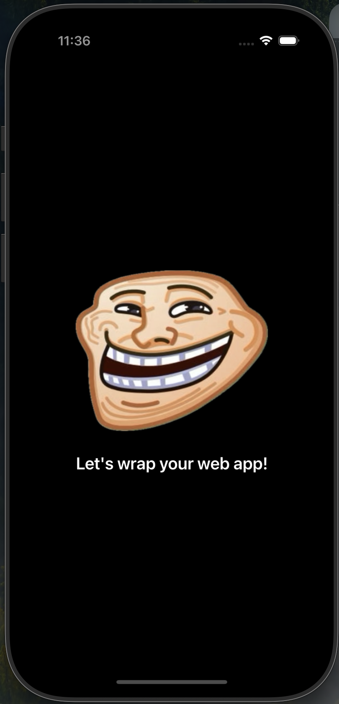
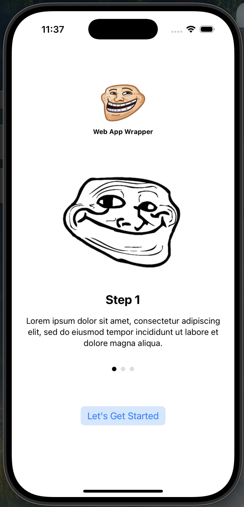
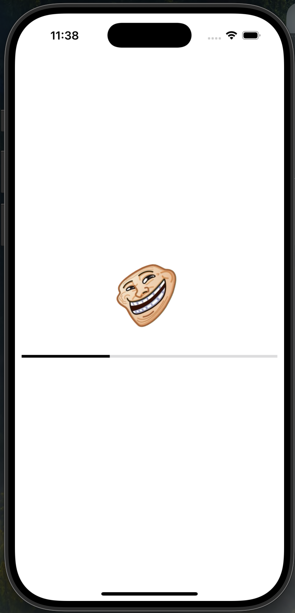
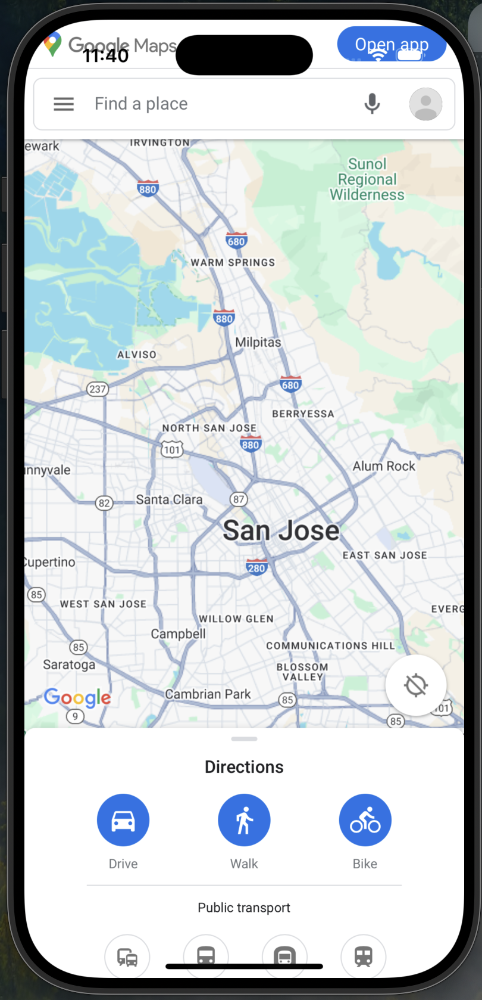

# WebAppWrapper for iOS

A simple wrapper for web app with
- Launch page
- Introduction slides
- Full-screen WebView
- Firebase notification
- app (universal) links
- location services (get current location, monitor location update in background, etc.)

## Additional settings
- Uncomment `FirebaseApp.configure()` and `Messaging.messaging().delegate = self` when your "GoogleService-Info.plist" is in place.
- For universal links, refer to Apple's [docs](https://developer.apple.com/documentation/xcode/supporting-associated-domains)

## Demo

  

      
      
Launch Screen

  

  

      
      
Introduction slides

  

  

      
      
Loading WebView

  

  

      
      
Full-screen WebView

  

